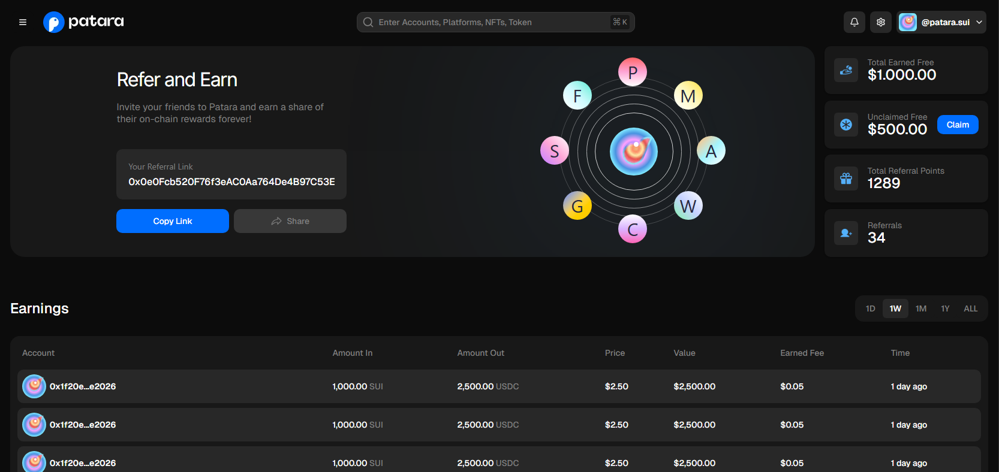

# 🏛️ Patara

Bu proje modern bir frontend mimarisi ile hazırlanmış bir kullanıcı arayüzü uygulamasıdır. Ağırlıklı olarak **Next.js**, **Tailwind CSS**, **Framer Motion**, **Typescript**, **Zustand** ve **shadcn/ui** gibi güncel kütüphanelerle geliştirilmiştir.

## 📦 Proje Türü

Bu proje **Next.js** (React tabanlı) ile geliştirilmiş bir **frontend uygulamasıdır**.

---

## 🚀 Kullanılan Teknolojiler & Kütüphaneler

- **Next.js** – React tabanlı SSR/SSG destekli framework
- **Typescript** – Tip güvenli JavaScript
- **Tailwind CSS** – Utility-first CSS framework
- **Framer Motion** – Animasyonlar için güçlü kütüphane
- **tailwindcss-animate** – Tailwind ile uyumlu animasyon desteği
- **Zustand** – Global state yönetimi
- **shadcn/ui** – Modern UI bileşen kütüphanesi
- **Radix UI** – Erişilebilir UI primitive bileşenler
- **Lucide React** – İkon kütüphanesi
- **clsx / class-variance-authority** – Dinamik class tanımlamaları

---
## Notlar
   Tasarımı elimden geldiğince özenle ve detaylara dikkat ederek oluşturmaya çalıştım. Gerçek hayattaki bir proje mantığıyla ilerlemeyi tercih ettiğim için kod yapısında sürdürülebilirlik ve geliştirilebilirlik önceliğim oldu. Bu nedenle bazı alanlarda — örneğin logo, yörünge içindeki görsel ya da gradient arka planlar gibi — daha hızlı ilerleyebilmek adına hazır görseller kullandım. Bu tercihler, asıl amacım olan mimari yapı ve kullanıcı deneyimine odaklanmamı sağladı.

## ⚙️ Projeyi Kurmak ve Çalıştırmak

```bash
1. git clone https://github.com/emirtetik/PataraCase.git
2. cd pataraCase
3. npm install
4. npm run dev
```

